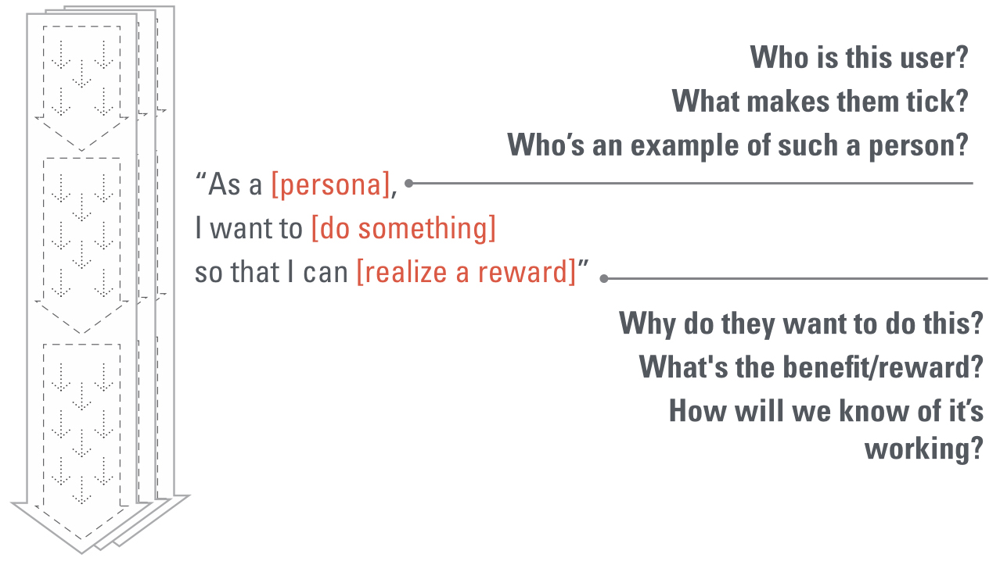

# Definition - writing user stories

#### What is a user story?

User stories have a specific format:

 “As a \[persona\],  
I want to \[do something\]  
so that I can \[realize a reward\]”


This format is designed to help the story writer be descriptive and to drive better discussions about implementation


 

> Skillful use of stories will improve your outcomes as well as your economics.

The \[persona\] is a humanised, operational description of your user

The \[do something\]  is a goal you assume the user has. 

The \[realize a reward\] clause is a _testable_ statement of how you’ll know if the user realized that goal.

> “As an HR manager, I want to match an open position’s required skills with quiz topics so I can create a quiz relevant for candidate screening.”

| \# | User story title | User story description | Priority | Notes |
| :--- | :--- | :--- | :--- | :--- |
| 1 | NTU - QA Agent - Selecting policies | I would like to have an NTU bin from which I can select policies to QA | Must have | 1. All policies that are ready for QA should appear in the bin 2. Check if this works |
| 2 | NTU - QA Agent - See the NTU agent who worked the policy | I would like to see the NTU agent's name reflecting on the policy when the policy is presented for QA | Must have |  |
| 3 | NTU - Team lead - View status of policies | So that I can manage the performance of my team |  |  |
| 4 | NTU - Team lead - Allocate policies marked for re-allocation |  |  |  |
| 5 | NTU - Team lead - Allocate Callback policies when necessary |  |  |  |
| 6 | NTU - Data Administrator - Load NTU policies into the system |  | Must have |  |
| 7 | NTU - NTU Agent - NTU bin to pull policies one at a time |  | Must have |  |
| 8 | NTU - NTU Agent - Conclude successful retention |  | Must have |  |
| 9 | NTU - NTU Agent - Conclude unsuccessful retention |  | Must have |  |
| 10 | NTU - NTU Agent - Schedule a callback |  | Must have |  |
| 11 | NTU - NTU Agent - View scheduled callbacks |  | Must have |  |
| 12 | NTU - NTU Agent - No Answer and Voicemails to go back into the bin for allocation |  | Must have |  |
| 13 | NTU - NTU Agent - Ability to request a re-allocation of the current policy |  |  |  |
|  |  |  |  |  |

